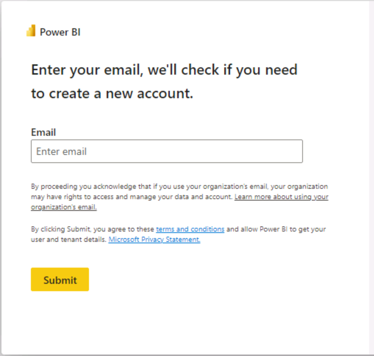
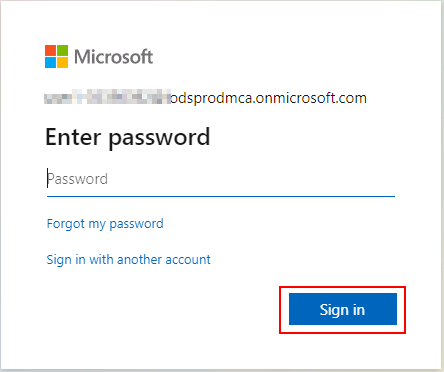
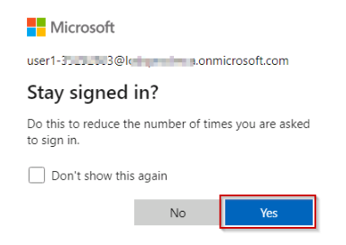
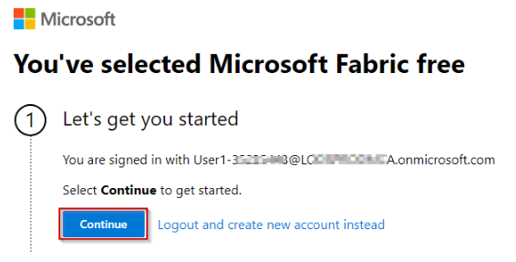
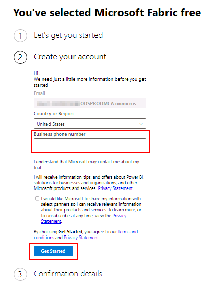
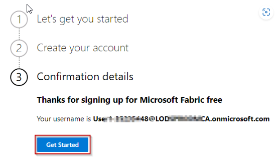
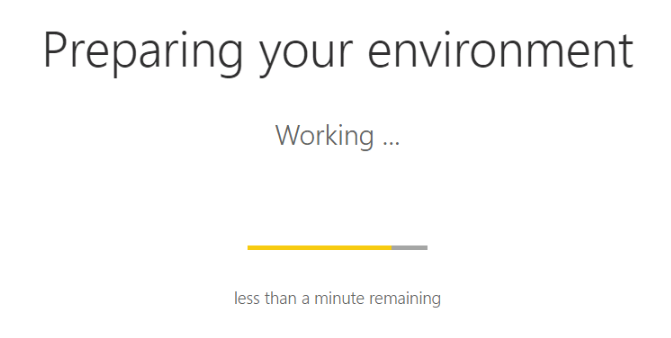
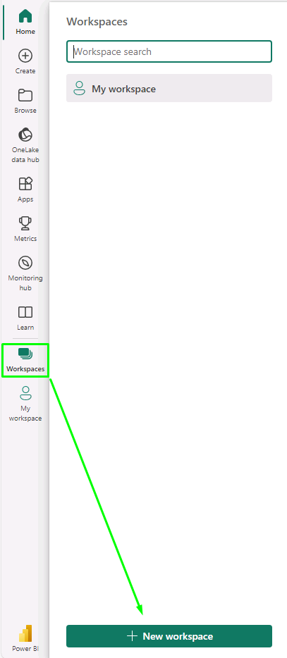
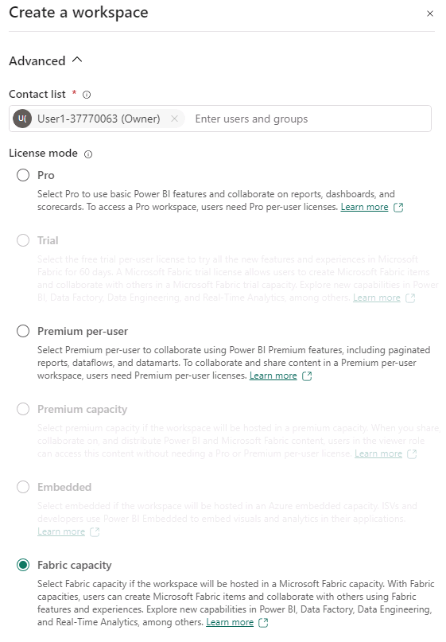

# Task 1.1: Create a Microsoft Fabric enabled workspace

1. Open a new tab and enter **https://app.powerbi.com/** to populate the **Power BI** URL and press **Enter**.

2. Enter the following email by selecting username +++**@lab.CloudPortalCredential(User1).Username**+++ and select **Submit**.

	

3. Enter the password by selecting +++**@lab.CloudPortalCredential(User1).Password**+++ and select **Sign in**.

	

4. If prompted to stay signed in, select **Yes**.

	

5. Select the **Continue** button.

	

6. Select **Business phone number box** and type a 10-digit number in the box by selecting +++1230000849+++. 

	

7. Again, select the **Get Started** button.

	

	**Wait for the PowerBI Workspace to load**

	

	*Close* the top bar for a better view.

8. Select the **+ New workspace** button.

	<!-- !IMAGE[euxmwptl.png](../media/instructions249094/euxmwptl.png) -->

	

9. Type the name +++**ContosoSales@lab.LabInstance.Id**+++ and **validate** the available name.

	{: .note }
 	>If you see the pop message **Upgrade to Power BI Pro License** do the following steps. Else skip to next exercise.
	>1. *Select the **Try free** button.*
	>2. *Select the **Got it** button to continue.*
	>3. Select **Workspaces** to verify if the workspace with the given name was created, if not perform the steps above again.

10. Under the **Advanced** drop down, select the **Fabric Capacity** option and select **Apply**.

	

	{: .note }
 	> If the workspace you created is not visible, perform **step 8** again.
	>If the name contosoSales is already taken, refresh the page and check again. The workspace might already be created.
