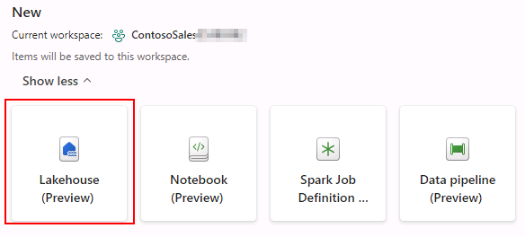
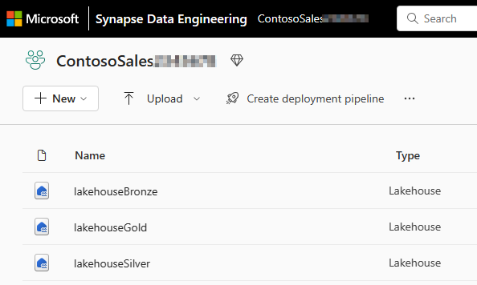

# Task 1.2: Create/Build a Lakehouse
Now, let's see how each department in Contoso could easily create a Lakehouse in their workspace without any provisioning needed by simply providing the name, given the proper access rights of course!

1. Select the **left bottom icon** and select **Data Engineering**.

    

2. In the new window, under Data Engineering, select **Lakehouse (Preview)**.

    

3. Enter the name: **lakehouseBronze**.

4. Select the **Create** button.

5. Repeat **steps 1 through 5** to create two more lakehouses with the following names by entering **lakehouseSilver** and **lakehouseGold** respectively.

	**NOTE**
	> For this lab we need three lakehouses altogether.

	

6. Select **Workspaces** in the left navigation pane and select **ContosoSales{Unique_ID}**

We are now ready to start data ingestion. As the above names suggest, we will showcase the Medallion architecture. This means we will ingest the raw data in the bronze layer first from disparate sources for Contoso. After that, the data will be curated and enriched to the silver and then gold layers.
