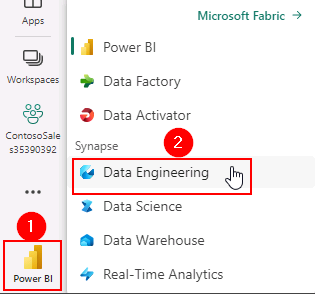
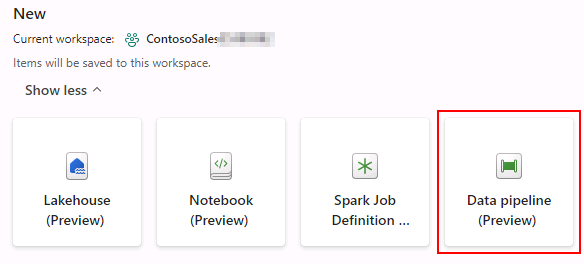
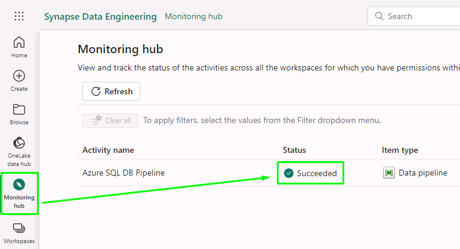
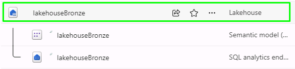

# Task 1.3: Data ingestion

There are multiple ways to ingest data in Lakehouse. 

## Method 1-Using Data Pipelines/Data Flow ‘No Code-Low Code experience’

1. In Power BI tab, while you are in the ContosoSales@lab.LabInstance.Id workspace, select the **left bottom icon** and select **Data Engineering**.

	

2. In Data Engineering, select **Data pipeline (Preview)**.

	

3. In the pop-up, type the pipeline name by selecting **Azure SQL DB Pipeline** and select the **Create** button.

4. Select **Copy data**.

5. In the pop-up, scroll down through the resources, select **Azure SQL Database** and then select the **Next** button.

6. Select the **Create new connection** radio button, if not selected.

7. In the **Server** field paste the value by selecting +++**@lab.Variable(sqlEndpoint)**+++ and enter **SalesDb** in the **Database** field.

8. Scroll down and select **Basic** for Authentication kind, enter **labsqladmin** as the Username, **Smoothie@2023** as the Password, keep **Use encrypted connection** check box **on/checked** and finally select the **Next** button.

	{: .note }
 	> Close any pop-up that you see and wait for the connection to be created.

9. **Select** the 'Existing tables' radio button, **select** the checkbox for the **First Table** below the Select all option, and then **select** the 'Next' button.

10. Scroll down and select **Lakehouse** and then select the **Next** button.

11. Select the **Existing Lakehouse** radio button, select the **dropdown**, select **lakehouseBronze** and then select the **Next** button.

12. Select the **Load to new table** radio button, select the checkbox beside **Source** and then select **Next**.

13. Select **Save + Run**.

14. Select the **Notifications Icon** at top right of the screen, select **Notifications**.

15. Verify the **Running status** of the pipeline.

	{: .note }
 	> Please wait for the pipeline to execute. If the notification continues to say running after 10 minutes, check the monitoring hub for a "succeeded" status.
	> 

16. Once the status shows **Run Succeeded**, your data has been transferred from Azure SQL Database to Lakehouse.

17. Similarly you can get data into the lakehouses using pipelines from various other sources like Snowflake, Dataverse, etc.

### Method 2-Using the ‘OneLake Shortcuts’ option from external data sources

This is something exciting! You will see how easy it is to create **shortcuts** without actually moving the data. That is the power of OneLake! In this exercise you will easily ingest the curated marketing data as well as product reviews data from ADLS Gen2. Let's see how!

1. In **Power BI** tab, select **Workspaces** and select the ContosoSales@lab.LabInstance.Id workspace.

2. In the ContosoSales@lab.LabInstance.Id workspace, select the **lakehouseBronze** Lakehouse.

	{: .note }
 	> There will be 3 options for lakehouseBronze, namely Lakehouse, Dataset (default) and SQL endpoint. Make sure to select the Lakehouse option.
	> 

3. Right-click or open the context menu on **Files** in the left explorer.

4. Select **New shortcut**.

5. In the pop-up window, under **External sources**, select the **Azure Data Lake Storage Gen2** source.

	{: .note }
 	> Wait for the screen to load.

6. We need to enter the connection details for the ADLS Gen2 shortcut. For this, we need to get the details from the Storage Account resource.

7. In the URL field above, paste the endpoint by selecting +++**https://storage@lab.LabInstance.Id.dfs.core.windows.net/**+++ **URL** field.

8. In the **Authentication kind** dropdown, select **Account Key**.

9. Paste the account key by selecting +++**@lab.Variable(storageAccountKey)**+++.

10. Select **Next**.

11. Under **Shortcut Name**, enter **data**.

12. Under **Sub Path**, enter **/adlsfabricshortcut**.

13. Select the **Create** button.

Litware has curated marketing data and sales data processed by Azure Databricks and stored in the gold layer in ADLS Gen2. You can easily create a shortcut in Microsoft Fabric without moving this data. **We will now create another shortcut for Litware Inc. data.**

14. Right-click or open the context menu on **Files** in the left explorer.

15. Select **New shortcut**.

16. In the pop-up window, under **External sources**, select the **Azure Data Lake Storage Gen2** source.

	{: .note }
 	> Wait for the screen to load.

17. In the URL field above, paste the endpoint under the **URL** field by selecting +++**https://storage@lab.LabInstance.Id.dfs.core.windows.net/**+++

	{: .note }
 	> The details entered earlier will be auto fetched. If not, the previous shortcut steps.

18. In the **Authentication kind** dropdown, select **Account Key**.

19. Paste the account key by selecting +++**@lab.Variable(storageAccountKey)**+++.

	{: .note }
 	> Wait for the storage AccountKey to be field automatically.

20. Select **Next**.

21. Under **Shortcut Name**, enter **sales-transaction-litware**.

22. Under **Sub Path**, enter **/bronzeshortcutdata**.

23. Select the **Create** button.
