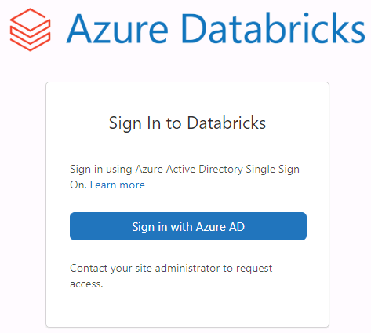
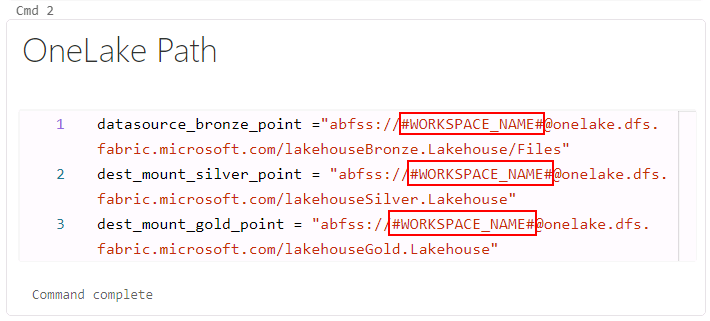

# Task 2.1: Set up an Azure Databricks environment

**Integrate OneLake with Databricks:**

- **Use OneLake with existing data lakes using Shortcuts**
- **Use and land data directly in OneLake**

In this exercise, you will use the second option **Use and land data directly in OneLake**.

Contoso already had some of their compute workload on **Azure Databricks**. You don’t need to migrate any of that workload to work with Fabric. You can simply use the OneLake endpoint to mount the storage and work with the same data directly from the Lakehouse for their analytical and ML operations.

**Currently there are two ways to authenticate OneLake.**
	
- **Credential passthrough**
- **Service Principal approach** (In this lab, you will use Service Principal approach)

7. Open new tab in your browser and sign in to the **Azure Databricks Workspace**, by clicking on +++**https://@lab.Variable(workspaceurl)**+++ and press **ENTER**.

8. Click on **Sign in with Azure AD**.
		

	>**Note:** Skip or Close any popups that appear.

10. In the left navigation pane, select **Workspace**, select **Workspace** in the Workspace navigation menu and then select the **01_Setup-OneLake_Integration_with_Databrick** notebook.

	>**Note:** Skip or Close any popups you see.

11. In the cell named **OneLake Path** or **cmd 2**, replace "#WORKSPACE_NAME#" with the current Fabric workspace name by clicking on +++ContosoSales@lab.LabInstance.Id+++.

	

13. Select the **Run all** button. A new window will pop up.

14. Select the **"Start, attach and run"** button to start executing the notebook.

15. Once the setup notebook runs successfully, mounting to the OneLake is complete.

	>**Note**: It will take a few minutes for the execution to complete. You can check the last cell of notebook for the last execution time to verify.
