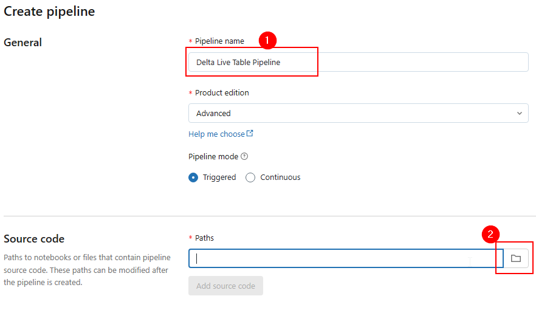
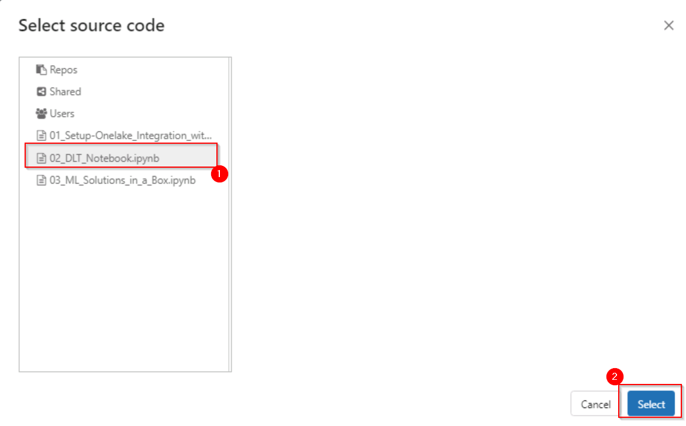

# Task 2.2: Create a Delta Live Table pipeline

In this task, you can create a Delta Live Table pipeline.

*Delta Live Tables (DLT) allow you to build and manage reliable data pipelines that deliver high-quality data in Lakehouse. DLT helps data engineering teams simplify ETL development and management with declarative pipeline development, automatic data testing, and deep visibility for monitoring and recovery.*

After mounting the OneLake location, it’s time to convert the **raw bronze files** into the **open standard delta parquet format**, supported by OneLake. 

This can be done using any Spark compute either in Microsoft Fabric or Azure Databricks. In this lab you will use DLT pipelines to process the raw data from OneLake and store it back in Open Delta tables (**Bronze>Silver>Gold Layer**).

1. Select the **Workflows** icon in the left navigation pane.

2. Select the **Delta Live Tables** tab and select the **Create pipeline** button.

3.	In the **Create pipeline window**, select the Pipeline name box and enter **Delta Live Table Pipeline**.

4.	In the Source Code field, select the notebook icon.

	

5.	In the **Select source code** window, select the **02_DLT_Notebook.ipynb** notebook and select **Select**.

	

7. Select the **Create** button.

	>**Note**: *Once you select **Create**, the Delta Live Table pipeline with all the notebook libraries added to the pipeline will be created.*

8. Select **Start**.

	>**Note**: *Databricks will start executing the pipeline which will take approximately 5 minutes.*

9. Observe the data lineage of bronze, silver and gold tables.
