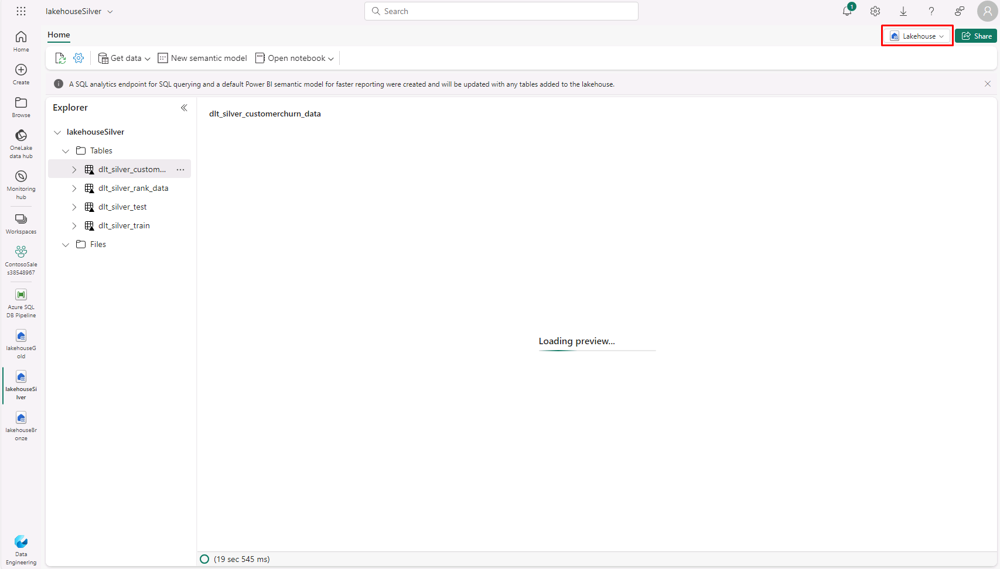

# Task 2.3: Explore SQL Analytics with Lakehouse SQL-endpoint

*Microsoft Fabric Lakehouse comes with a default SQL endpoint which can be used for querying purposes using SQL syntax.*

*We can go from Lakehouse to SQL endpoint in the same window by selecting SQL endpoint from the Lakehouse dropdown menu in the top right corner of the window.*

1. Switch to the Power BI workspace browser tab.  
	If necessary, browse to **https://apps.powerbi.com** and the select **Workspaces**.

1. In the Fabric workspace, in the left navigation, select **lakehouseSilver**.

	{: .note }
	> You can also search and select **lakehouseSilver** from the ContosoSales@lab.LabInstance.Id workspace.

2. Hard refresh the page using **Ctrl+Shift+R**. 

	**A hard refresh helps load the delta tables in the lakehouse.**

3. Select **Lakehouse** in the top right corner of the screen and select **SQL analytics endpoint**.

	

	{: .note }
 	> Wait for the SQL endpoint to load.

4. Here is a list of all the tables in open-standard delta format. We can run queries on these tables to get the insights we need for the next step.

We can write a query to get the insights from sales data that we ingested using the shortcut names **sales-transaction-litware**.

We can also run queries with complex joins on the same table to get LitWare Inc.’s bestselling product category and see how fast we can get the results. When running the queries, we get the result within seconds, and once it is in cold cache, it will take even less time to get the results. These queries showcase the data engineering experience in Microsoft Fabric.

You also have an option to create a visual query.
