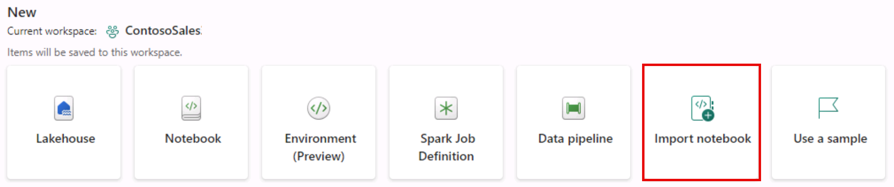
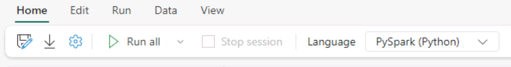
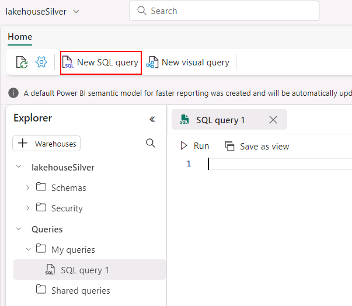
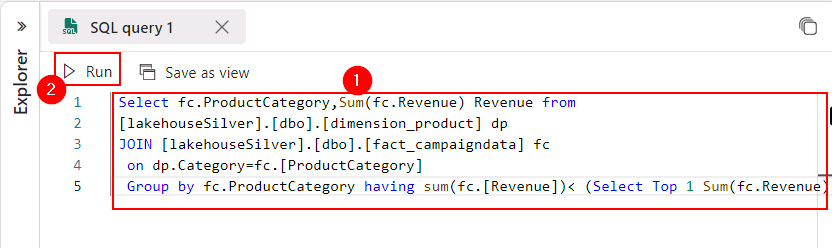
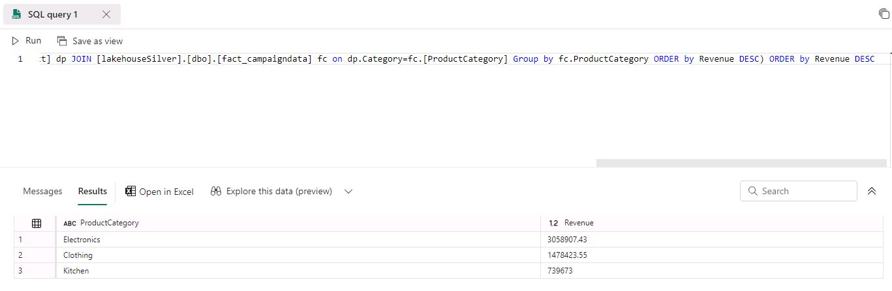

# Task 3.1: Build ML models, experiments, and Log ML model in the built-in model registry using MLflow and batch scoring

## Databricks

The architecture diagram shown here illustrates the end-to-end MLOps pipeline using the Azure Databricks managed MLflow. 

After multiple iterations with various hyperparameters, the best performing model is registered in the Databricks MLflow model registry. Then it is set up as the model serving in the Azure Databricks Workspace for low latency requests.


1. Switch back to the **Databricks workspace** tab from the previous exercise.

2. In the left navigation, select **Workspace**.

2. In the **Workspace** pane, select **Workspace** and then select the **03_ML_Solutions_in_a_Box.ipynb** notebook.

	Now that we've processed our customer data, let us use Machine learning model to predict customer churn.

	Ultimately, we would like to understand our customers' sentiment so we can create targeted campaigns to improve our sales.

3. Go to **cmd 10**.

	With the data prepared, we can begin exploring the patterns it contains. 

	As illustrated in this chart, we can see a high churn rate is seen if the customer tenure is low, and they have a lower spend amount.

	<!-- 4. Go to **cmd 20**. -->

5. Go to **cmd 21**. 

	By registering this model in Model Registry, we can easily reference the model from anywhere within Databricks. 

6. Review the **cmd 29** cell.

	This comparison of multiple runs using a parallel coordinates plot, shows the impact of different parameter values on a metric.

	The best ML model for Customer Churn is selected and registered with Databricks model registry.

7. Go to **cmd 40**.

	It is then used to predict the probability of Customer Churn using the deployed model and this model endpoint is ready for production.

   

8. Go to **cmd 41**. 

	Once we have the predicted data, it is stored back in delta tables in the gold layer back in OneLake.


## Data ingestion: Notebook Code-first experience

As Data Engineer, you will explorer another option for ingesting the data. This time Eva prefers using the code-first experience. 

1. Switch to the Power BI workspace browser tab, in the lower left corner, select the icon and then select **Data Engineering**.

	

2. Select **Import notebook**.

	
	
3. In the **Import Status** pane, select **Upload**.
	
4. Browse to **C:\Ignite Assets\IgniteDreamLab2023\artifacts\fabricnotebooks**, select all of the notebooks and then select **Open**.

5. Select the **notification** icon to check the upload status. 

6. Once the upload is complete, the notification will display **Imported successfully**. Select **Go to Workspace**.

7. In the **ContosoSales@lab.LabInstance.Id** workspace, select the **01 Marketing Data to Lakehouse (Bronze) - Code-First Experience** notebook.

8. In the left pane, select **Lakehouses**, select **Missing Lakehouse** and select **Remove all Lakehouses**.

	{: .note }
 	> If you do not see Missing lakehouse, you may see **lakehouse{Name}**, select it to get the **Remove all Lakehouses** option.

9. Select **Continue**.

10. In the left navigation pane, select **Add**.

11. In the Add Lakehouse window, select **Existing Lakehouse** and then select **Add**.

12. Select the **lakehouseBronze** checkbox and then select **Add**.

	

13. Close the **Information box** for a better view of the notebook content.

14. Scroll down to the cell named **Shortcut Folder Path**, replace **#WORKSPACE_NAME#** , select **ContosoSales@lab.LabInstance.Id**.

	{: .note }
 	> Make sure you delete the **"#"** too in above step.
		

15. On the menu, select **Run all**.

	

16. Wait for the cells to complete. This may take 3-5 minutes.


## SQL Query

1. In **Power BI**, select **Workspaces** and select the ContosoSales@lab.LabInstance.Id workspace.

1. In the ContosoSales@lab.LabInstance.Id workspace, select the **lakehouseSilver** Lakehouse.

1. Select **New SQL Query**.

	

2. Enter the following SQL query:
	```-wrap
	Select fc.ProductCategory,Sum(fc.Revenue) Revenue from [lakehouseSilver].[dbo].[dimension_product] dp JOIN [lakehouseSilver].[dbo].[fact_campaigndata] fc on dp.Category=fc.[ProductCategory] Group by fc.ProductCategory having sum(fc.[Revenue])< (Select Top 1 Sum(fc.Revenue) Revenue from [lakehouseSilver].[dbo].[dimension_product] dp JOIN [lakehouseSilver].[dbo].[fact_campaigndata] fc on dp.Category=fc.[ProductCategory] Group by fc.ProductCategory ORDER by Revenue DESC) ORDER by Revenue DESC 
	```

3. Select **Run**.

	

4. Review the results of the query.

	
