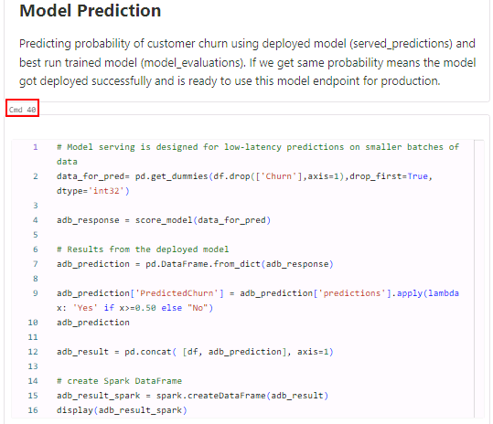
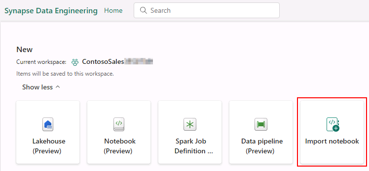
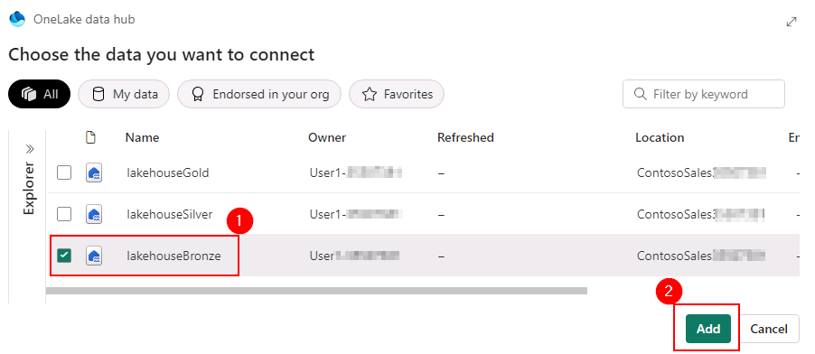
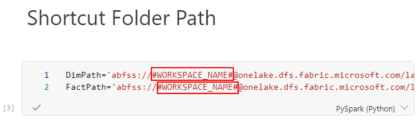

# Task 3.1: Build ML models, experiments, and Log ML model in the built-in model registry using MLflow and batch scoring.

## Databricks

The architecture diagram shown here illustrates the end-to-end MLOps pipeline using the Azure Databricks managed MLflow. 

After multiple iterations with various hyperparameters, the best performing model is registered in the Databricks MLflow model registry. Then it is set up as the model serving in the Azure Databricks Workspace for low latency requests.


1. Navigate back to the **Databricks workspace tab** we started for the previous exercise.

2. In the left navigation pane, select **Workspace** and select **Workspace** again. Select the **03_ML_Solutions_in_a_Box.ipynb** notebook.

	Now that we've processed our customer data, let us use Machine learning model to predict customer churn.

	Ultimately, we would like to understand our customers' sentiment so we can create targeted campaigns to improve our sales.

3. Navigate to **cmd 10**.

	With the data prepared, we can begin exploring the patterns it contains. 

	As illustrated in this chart, we can see a high churn rate is seen if the customer tenure is low, and they have a lower spend amount.

4. Navigate to **cmd 20**.

5. Navigate to **cmd 21**. 

	By registering this model in Model Registry, we can easily reference the model from anywhere within Databricks. 

6. Review the **cmd 29** cell.

	This comparison of multiple runs using a parallel coordinates plot, shows the impact of different parameter values on a metric.

	The best ML model for Customer Churn is selected and registered with Databricks model registry.

7. Navigate to **cmd 40**.

	It is then used to predict the probability of Customer Churn using the deployed model and this model endpoint is ready for production.

   

8. Navigate to **cmd 41**. 

	Once we have the predicted data, it is stored back in delta tables in the gold layer back in OneLake.

## Data ingestion: Notebook Code-first experience

As a Data Engineer, you will explorer another option for ingesting the data. This time Eva prefers using the code-first experience. 

1. While you are in the **Power BI workspace**, select the bottom left corner and select **Data Engineering**.

	

2. Select **Import notebook**.

	
	
3. In the **Import Status**, select the **Upload** button.
	
4. To browse the notebooks from your virtual machine, open file explorer. Select the whitespace in the **files search bar**, type **C:\Ignite Assets\IgniteDreamLab2023\artifacts\fabricnotebooks** for the path, **select all of the notebooks** and select the **Open** button in your file explorer.

5. Select the **notification** icon to check the upload status. 

6. Once the upload is complete, the notification will display **Imported successfully**. Select **Go to Workspace**.

7. Go to the **ContosoSales@lab.LabInstance.Id** workspace and select the **01 Marketing Data to Lakehouse (Bronze) - Code-First Experience** notebook.

8. In the left pane, select the **Missing Lakehouse** button and select **Remove all Lakehouses**.

	{: .note }
	> If you do not see Missing lakehouse, you may see **lakehouse{Name}**, select it to get the **Remove all Lakehouses** option.

9. Select **Continue** in the pop-up window.

10. In the left navigation pane, select the **Add** button.

11. In the pop-up, select the **Existing Lakehouse** radio button and then select the **Add** button.

12. Select the **lakehouseBronze** checkbox and then select **Add**.

	

13. Close the **Information box** for a better view of the notebook content.

14. Go to the cell with name **Shortcut Folder Path**, replace **#WORKSPACE_NAME#** by selecting +++**ContosoSales@lab.LabInstance.Id**+++.

	{: .note }
 	> Make sure you delete the **"#"** too in above step.
		

15. Select **Run all**

## SQL Query

1. Select the **New SQL Query** button.

	

2. Copy the **SQL query** by selecting 
	```
	Select fc.ProductCategory,Sum(fc.Revenue) Revenue from [lakehouseSilver].[dbo].[dimension_product] dp JOIN [lakehouseSilver].[dbo].[fact_campaigndata] fc on dp.Category=fc.[ProductCategory] Group by fc.ProductCategory having sum(fc.[Revenue])< (Select Top 1 Sum(fc.Revenue) Revenue from [lakehouseSilver].[dbo].[dimension_product] dp JOIN [lakehouseSilver].[dbo].[fact_campaigndata] fc on dp.Category=fc.[ProductCategory] Group by fc.ProductCategory ORDER by Revenue DESC) ORDER by Revenue DESC 
	```

3. Select the **Run** icon to view the query result.
	!IMAGE[task-2.3-sql44.png](../media/instructions240153/task-2.3-sql44.png)
