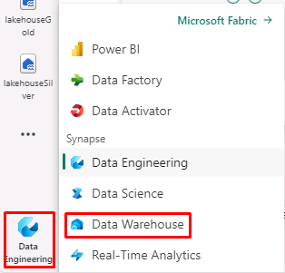

# Task 4.1: Create a Data Warehouse

1. In the lower left corner select the icon. This may be **Data Engineering**, **Power BI**, etc.

	

2. Select **Data Warehouse**.

3. Select **Warehouse**.

4. In the New Warehouse window, in the **Name** box, enter **salesDW**.

5. Select **Create**.

	{: .note }
 	> Wait for the Data Warehouse creation.
