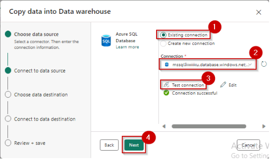
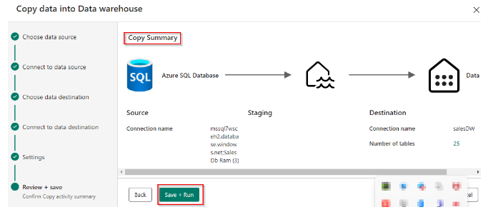
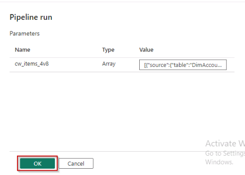
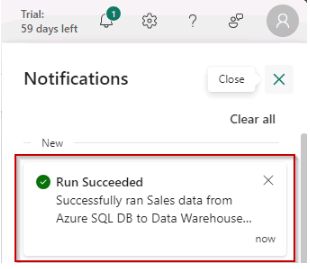

# Task 4.2: Load data in the warehouse

1. Select **Get data**.

2. Select **New data pipeline**.

	{: .note }
	>It will take some time for the page to load.

3. In the pop-up, enter **02 Sales data from Azure SQL DB to Data Warehouse** in the name.

4. Select **Create**.

5. Wait for a new pop-up.

6. Scroll down in the pop-up.

7. Select **Azure SQL Database**.

8. Select the **Next** button.

9. Select the **Existing Connection** radio button.

10. Select the existing connection from the dropdown in the **Connection** field.

11. Select **Test Connection** and then select the **Next** button.

	
	
12. In **Connect to data source**, select **Existing tables**, select **Select all** and then select the **Next** button.

13. In **Choose data destination** select the **Data Warehouse** and select the **Next** button.

14. In **Connect to data destination**, select **Load to new table** and select the **Source** checkbox. Then select the **Next** button.

15. In the **Settings** section, keep it default and select the **Next** button.

16. In the **Review + save** section, scroll down to the end and then select the **Save + Run** button.

		

	{: .note }
	>When you select 'Save + Run' the pipeline is automatically triggered.

17. If the below screen is prompted select the **OK** button.

		

18. Check the notification or pipeline output screen for the progress of copy database.

19. In the progress section of the pipeline, check the status of the running pipeline.

	{: .note }
	>Wait for the resultant data to load.

20. Wait for the status of the pipeline to display **Succeeded**.

	
