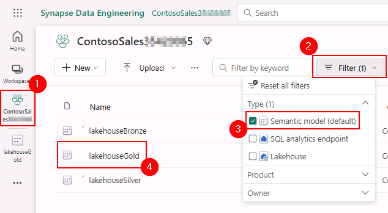
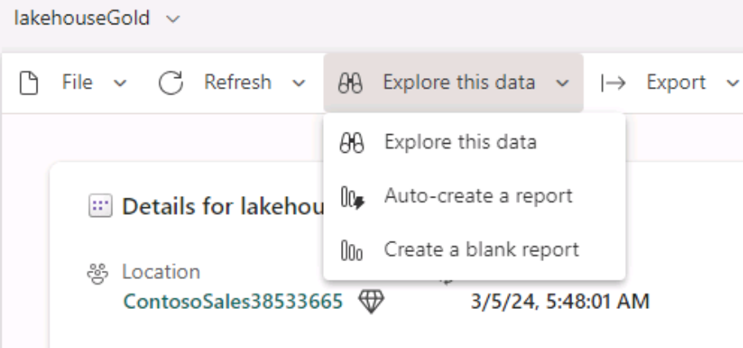

# Task 5.1: Leverage Power BI to derive actionable insights from data in Lakehouse using Direct Lake mode

1. Open a new web session (browser tab) in the VM, and then go to **https://powerbi.com**

	{: .note }
 	> Dismiss any notifications that may be displayed.

2. In Power BI, select the **ContosoSales@lab.LabInstance.Id** workspace and **Filter** on **Semantic model (default)**. Select the **lakehouseGold** Semantic model.
   
	

4. Remove the filter that was added earlier.

3. On the menu, select **Explore this data** and then select **Create a blank report**.

	

3. In the **Cannot load model** dialog box, select **Close**.

4. You can drag and drop visuals from the **Visualization** pane. We will upload a pre-created PBI report.

5. In the left navigation, select the **ContosoSales@lab.LabInstance.Id** workspace. 

6. On the menu, select **Upload** and select **Browse**.

7. Go to **C:\Ignite Assets\IgniteDreamLab2023\artifacts\reports**, select the **Campaign Analytics Report with Lakehouse.pbix** report and select **Open**.

	{: .note }
 	> Wait for the report to upload.

8. Select the **Campaign Analytics Report with Lakehouse** report. You can see which one to select using the **Type** column.
	{: .note }
 	> Make sure to select the **Report** and not the Dataset or Dashboard which is auto created with the same name.

9. This report has three sections:
	- Churn Analysis
	- Campaign Analytics
	- Website Analytics

10. Let's go to the **Churn Analysis** tab, where we analyze Customer Churn. This report, along with the Campaign Analytics and Website Analytics reports in Power BI, are coming from the data Lakehouse that we created in earlier exercises.

	In the **Scatter Chart** on the left, the blue dots represent customers that are more likely to churn, and the peach dots represent customers that are less likely to churn. Notice that when customer tenure is low and their spend amount is low, the customers are more likely to churn.

	With this insight, Contoso team decides to target customers with lesser tenure and lesser spend amounts through their new campaigns.

	Now, let's go Campaign Analytics.

11. Select the **Campaign Analytics** tab from the top right pane to go to the Campaign Analytics report.

	In this Campaign Analytics report, the bar chart shows that the most popular campaigns Contoso launched were gogreen and sustainablefashion.

	Now, let's go Website Analytics. 

12. Select **Website Analytics** from the top right pane to go to the Website Analytics Report.

Here we see an immediate problem for Contoso. The bounce rate of customers from their web site is high. In fact a large population of the unhappy customers who contribute to the high bounce rate on their website are Millennials. It turns out that when the millennial customers use their mobile devices to search for their favorite products such as beach accessories, their product searches are failing! That is the reason why millennials are unhappy. 

Contoso reduced their bounce rate by implementing a mobile-friendly website with fast product searches, focusing on high demand products for millennials. These changes improved the bounce rate and increased sales.

Congratulations! You, as a part of Contoso's technical team played the roles of a Data Engineer, Data Scientist, Data/ Business Analyst to help Contoso gain actionable insights from its disparate data sources, thereby contributing to future growth, customer satisfaction, and a competitive advantage.

During our exercises, we saw how they leveraged the power of Microsoft Fabric to ingest data from disparate sources, combine data with their existing data from ADLS Gen2, derive meaningful insights. You experienced how the team used a shortcut to reference the existing  Litware Inc data from ADLS Gen2. You also experienced how they mounted the OneLake endpoint in Azure Databricks to derive meaningful insights using the compute in Azure Databricks.  
Finally, we leveraged Power BI to derive actionable insights from data in the Lakehouse using Direct Lake mode.

As a result of all these data insights, Contoso had a great year and they celebrated on December 31st with fireworks! 
