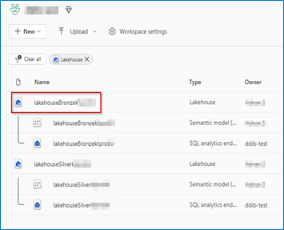
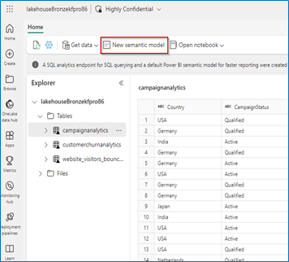
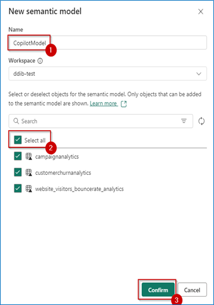
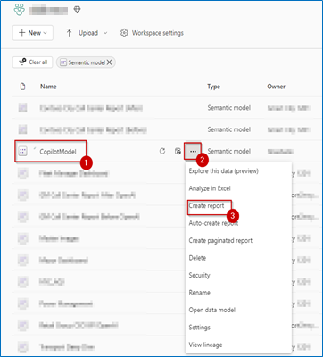
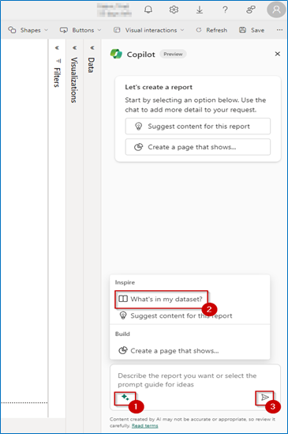
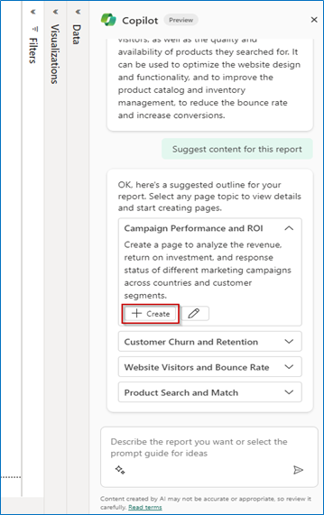
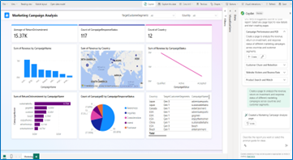
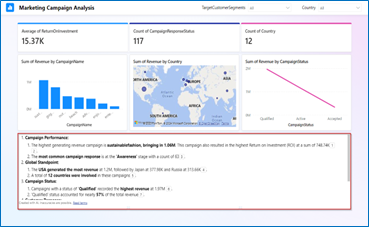

# Task 5.2: Copilot for Power BI

Let's explore some great features of Copilot in Power BI and see how they help Wendy, the Business Analyst, gain actionable insights. She uses Direct Lake mode queries directly from the lake, so that the new Power BI semantic model enjoys blazing fast query performance on par with import mode. Data Analysis can occur without having to copy a single row of data.

After she logs into Power BI, Wendy can see the Fabric Workspaces she has access to on the Home Page.

1. Open the **Power Bi Home** page and select **Workspaces**.

	

1. Select **ContosoSales@lab.LabInstance.Id**.

	

1. Select **lakehouseBronze**.

	

1. Select **New semantic model**.

	

1. In the New semantic Model window, in the **Name** box, enter **CopilotModel**, select the **Select** all checkbox and then select **Confirm**.

	

1. In the left navigation, select **ContosoSales@lab.LabInstance.Id**.

	

1. Locate the **CopilotModel** Semantic model, select **More options** ellipsis, and then select **Create report**.

	

1. On the right, minimize all the panes.

1. On the menu, select **Copilot**.

	

1. In Copilot, select **Inspire**. This is the Glitter icon at the bottom left of the chat window.

1. In the **Inspire** section, select **What's in my dataset?** and then select **Send**.

	

1. In Copilot, select **Inspire** (The Glitter icon at the bottom left of the chat window).

1. In the **Inspire** section, select **Suggest content for this report** and then select **Send**.

	

1. Select **Create**.

	

1. Review the results that are displayed on the left side of the pane.

	

	{: .note }
 	> The pages generated might differ from the ones shown in the screenshot.

1. Expand the **Visualizations** pane.

1. Select top left chart/table visual on the report to replace it with the Smart Narrative visual.

1. From the **Visualizations** pane, select **Smart Narrative visual**.

1. Select **Copilot**.

	

1. Select **Give an executive summary** and then select **Create**.

	

1. Review the executive summary generated by the Smart Narrative visual.

	

The Smart Narratives using AI and Copilot features summarize the data from all the visuals that are present on the page.

This is where the magic of Copilot is seen! It's clear that the website has a high bounce rate, especially for beach products and mobile phone users. When Wendy scrolls down, it becomes clear that the websites search function needs improvement as it causes frustration for customers. Copilot notes that due to the poor search unction, customers are not finding what they are looking for easily which potentially causes the high bounce rate. Further down Copilot also highlights the need for website optimization for mobile users. It notes that mobile users have the lowest customer sentiment and the highest churn probability. Wendy also discovers that beach products have the highest bounce rate, indicating that customers are not interested or engaged in them. Copilot suggests that the website may need to diversify beach products, lower its prices, or improve promotions. Copilots last suggestion is to leverage their strengths and opportunities in different companies. It highlights that they may want to tailor the website and marketing messages to suit the preferences and needs of these countries.

All this analysis was done in a matter of minutes, thanks to Copilot. With these findings in hand, Contoso's leadership swings into action and decides to implement changes on their portal, so product searches are quick and efficient. This helps customers quickly find their favorite products on Contoso's now mobile-friendly website.
