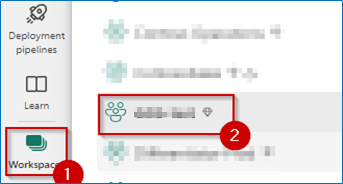
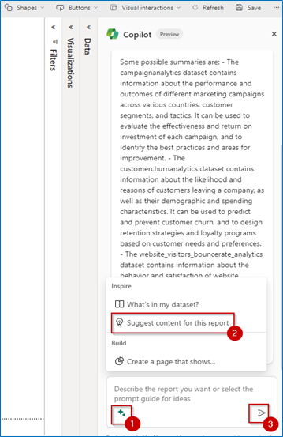
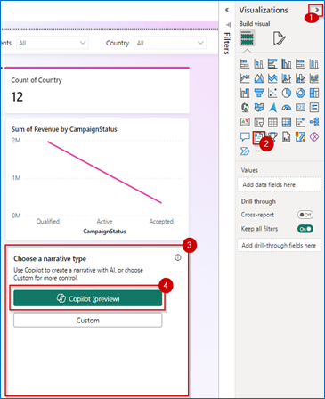
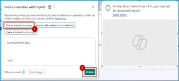

# Task 5.2: Copilot for Power BI

Let's explore some great features of Copilot in Power BI and see how they help Wendy, the Business Analyst, gain actionable insights. She uses Direct Lake mode queries directly from the lake, so that the new Power BI semantic model enjoys blazing fast query performance on par with import mode. Data Analysis can occur without having to copy a single row of data.

After she logs into Power BI, Wendy can see the Fabric Workspaces she has access to on the Home Page.

1. Open the **PowerBi Home** page and select **Workspaces**.

	

1. From the menu that appears, choose **ContosoSales{Unique_ID}**.

	

1. In the upper-left corner, select **Filter** and sort by **Semantic model**.

	

1. Select **lakehouseBronze**.

	

1. Select the **New semantic model** button.

	

1. Type in a name for the New semantic Model **CopilotModel**, select the Select all checkbox and then select the **Confirm** button.

	

1. Select **Workspaces**.

	

1. From the menu that appears, choose **ContosoSales{Unique_ID}**.

	

1. Filter for **Semantic model**.

	

1. Search for **CopilotModel**, select the **three dots** and then select **Create report option**.

	

1. Minimize all the panes on the right side.

1. Select **Copilot**.

	

1. In Copilot, select the **Inspire** button (The Glitter icon at the bottom left of the chat window).

1. Select the option **What’s in my dataset?** under the Inspire pane and then select the **Send** button.

	

1. In Copilot, select the **Inspire** button (The Glitter icon at the bottom left of the chat window).

1. Select the option **Suggest content for this report** under the Inspire pane and then select the **Send** button.

	

1. Select the **Create** button.

	

1. Observe the results that are displayed on the left side of the pane.

	

	**NOTE**
 	> The pages generated might differ from the ones shown in the screenshot.

1. Expand the **Visualizations** section.

1. Select the **top left chart/table visual** on the report to replace it with the Smart Narrative visual.

1. From the **Visualizations** pane, select the **Smart Narrative visual** button.

1. Select the **Copilot (preview)** button.

	

1. Select **Give an executive summary** and then select the **Create button**.

	

1. Show the executive summary generated by the Smart Narrative visual.

	

The Smart Narratives using AI and Copilot features to summarize the data from all the visuals that are present on the page.

This is where the magic of Copilot is seen! It's clear that the website has a high bounce rate, especially for beach products and mobile phone users. When Wendy scrolls down, it becomes clear that the websites search function needs improvement as it causes frustration for customers. Copilot notes that due to the poor search function, customers are not finding what they're looking for easily which potentially causes the high bounce rate. Further down, Copilot also highlights the need for website optimization for mobile users. It notes that mobile users have the lowest customer sentiment and the highest churn probability. Wendy also discovers that beach products have the highest bounce rate, indicating that customers are not interested or engaged in them. Copilot suggests that the website may need to diversify beach products, lower its prices, or improve promotions. Copilot's last suggestion is to leverage their strengths and opportunities in different companies. It highlights that they may want to tailor the website and marketing messages to suit the preferences and needs of these countries.

All this analysis was done in a matter of minutes, thanks to Copilot. With these findings in hand, Contoso's leadership swings into action and decides to implement changes on their portal, so product searches are quick and efficient. This helps customers quickly find their favorite products on Contoso's now mobile-friendly website.
