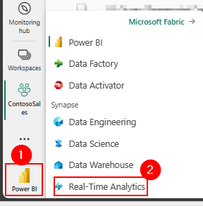

# Task 6.1: Create a KQL Database

1. In Power BI, select **Workspaces** and select **contosoSales**. 

2. Select the lower-left icon and select **Real-Time Analytics Experience**.

	

3. In the new window, under **Real-Time Analytics Experience**, select **KQL Database (Preview)**.

	

4. In the **Name** box, enter **Contoso-KQL-DB** and select **Create** and wait for the database to be created.
