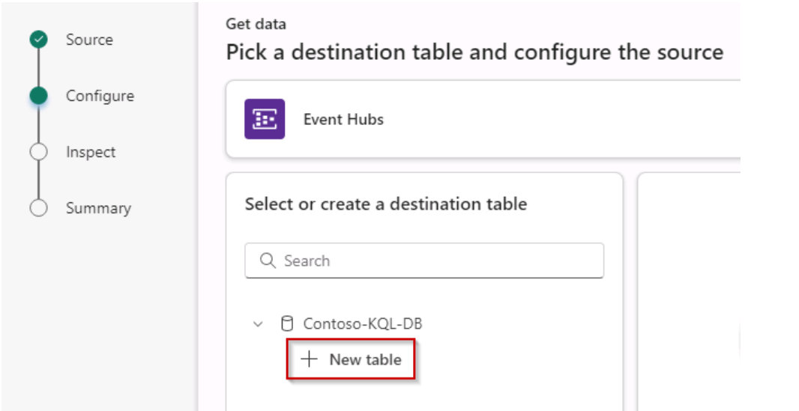
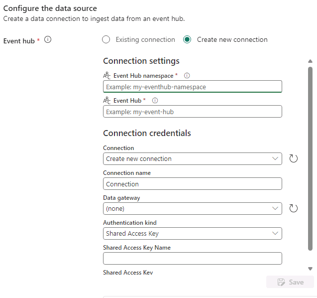
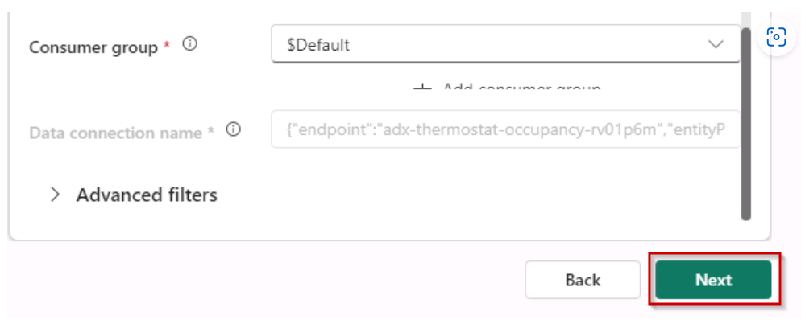
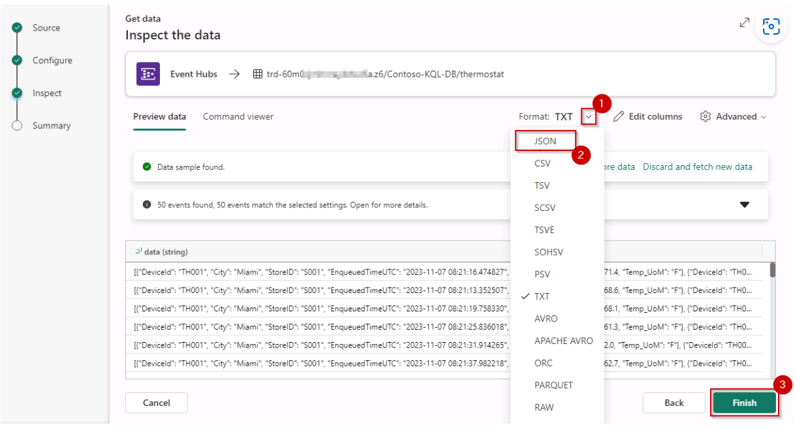
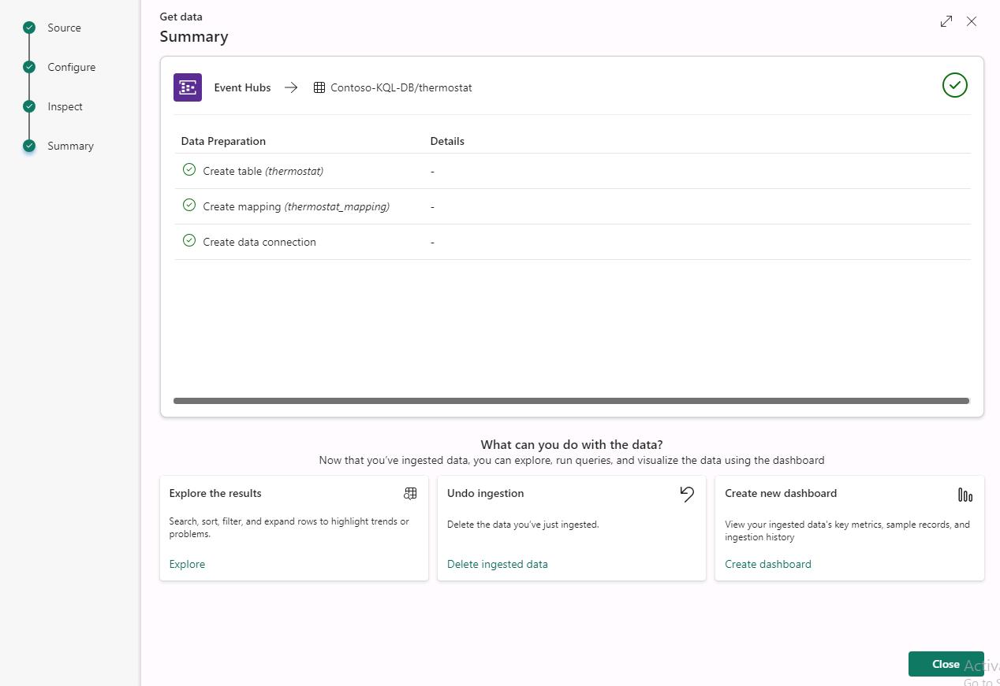

# Task 6.2: Ingest real-time/historical data into KQL DB

1. Once the database is created, select the dropdown of **Get data** and then select **Event Hubs**.

2. Select **+ New table** and type the name **thermostat**

    

3. Scroll right and select the **Create new connection** radio button. Enter **adx-thermostat-occupancy-{Unique_ID}** as the value for **Event Hub namespace** and enter **thermostat** for the **Event Hub** value.

	

4. Scroll down. For Authentication kind, select **Shared Access Key**, for the Shared Access Key Name enter by selecting **thermostat** and then for the Shared Access Key paste the value by selecting **@lab.Variable(evhsaskey)** in the **Shared Access Key** and select the **Save** button.

5. After you select the Save button, select **$default 'Consumer group'** and select the **Next** button.

	

	**NOTE**
	> In the schema tab, data loading will take some time.

6. In the Inspect tab, select the dropdown menu next to **format**, select **JSON** and select the **Finish** button.

    

7. Wait for the ingestion to complete, you will notice green checks that denote the completion. Finally, select the **Close** button.

	

8. Hard refresh the page using **Ctrl + Shift + R** to see the details for the ingested data.
	
Real-time data from the event hub has been ingested successfully into the KQL Database.
