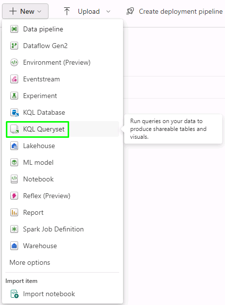
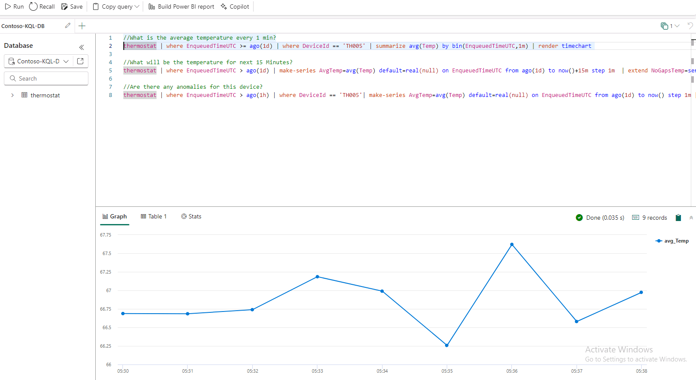
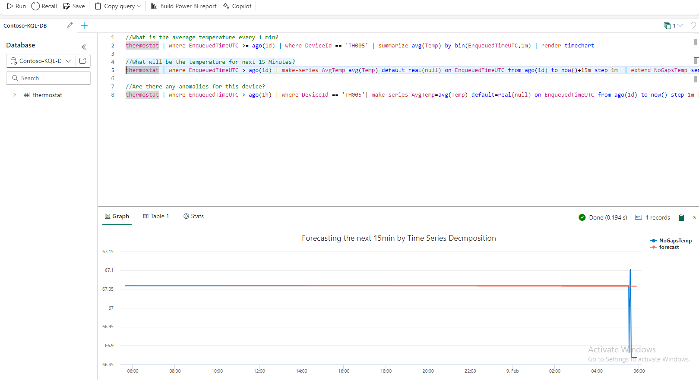
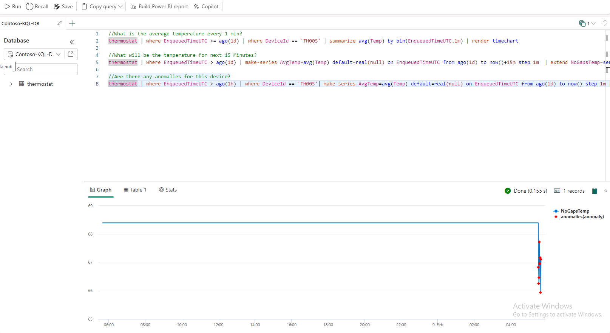

# Task 6.3: Analyze/discover patterns, identify anomalies and outliers using Kusto Query Language

In this scenario Kusto Query Language (KQL) is used to explore Contoso’s data, discover patterns, identify anomalies etc. 
We use KQL to query the thermostat data that’s streaming in near real-time from the devices installed in Contoso’s stores.

1. Select **Workspaces** and select **ContosoSales@lab.LabInstance.Id**.

2. Select **+ New** and then select **KQL Queryset**.

	

3. Enter **Query Thermostat Data in Near Real-time using KQL Script** as the name and select the **Create** button.

4. Wait for the query set creation and a new screen will display. In this screen, select the **Contoso-KQL-DB**, verify the workspace name and then select the **Select** button.

5. Select all using **Ctrl + A** and delete the pre-written query.

6. Paste the query provided below in the query section.

	```
	//What is the average temperature every 1 min?
	thermostat | where EnqueuedTimeUTC >= ago(1d) | where DeviceId == 'TH005' | summarize avg(Temp) by bin(EnqueuedTimeUTC,1m) | render timechart 

	//What will be the temperature for next 15 Minutes?
	thermostat | where EnqueuedTimeUTC > ago(1d) | make-series AvgTemp=avg(Temp) default=real(null) on EnqueuedTimeUTC from ago(1d) to now()+15m step 1m  | extend NoGapsTemp=series_fill_linear(AvgTemp) | project EnqueuedTimeUTC, NoGapsTemp | extend forecast = series_decompose_forecast(NoGapsTemp, 15) | render timechart with(title='Forecasting the next 15min by Time Series Decmposition')

	//Are there any anomalies for this device?
	thermostat | where EnqueuedTimeUTC > ago(1h) | where DeviceId == 'TH005'| make-series AvgTemp=avg(Temp) default=real(null) on EnqueuedTimeUTC from ago(1d) to now() step 1m | extend NoGapsTemp=series_fill_linear(AvgTemp) | project EnqueuedTimeUTC, NoGapsTemp | extend anomalies = series_decompose_anomalies(NoGapsTemp,1) | render anomalychart with(anomalycolumns=anomalies)

	```

7. Select the query. **(Line 2)**

8. Select **Run**.

	

	The graph/result visualizes the data in a line chart. We see that it looks like the temperature is currently quite pleasant.

9. Select the query. **(Line 5)**

10. Select **Run**.

	

	The graph/result visualizes the average temperature in the next 15 minutes, in anticipation of heavy foot traffic due to the ongoing sale. 

11. Select the query. **(Line 8)**

12. Select **Run**.

	


The third query is executed to keep an eye on the temperature and detect any anomalies. 
A sudden rise or drop in temperature triggers an alert for the Contoso staff to check the situation and take necessary action to bring the temperature back to an optimal level.
