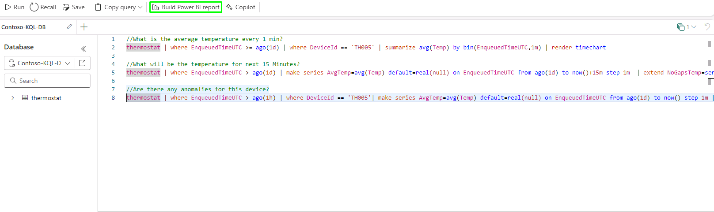
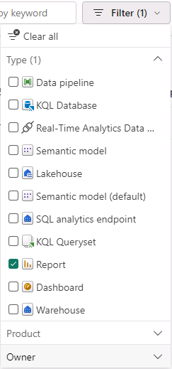
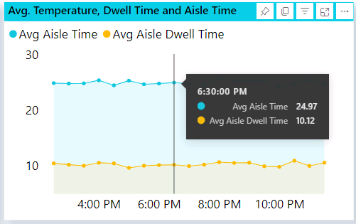

# Task 6.4: Create a Real-time Power BI report using KQL DB/KQL Query

1. Select **Build Power BI report**.

	

2. Hover over the Power BI Report layout and navigation panel.

3. Review the table on the right side.

4. Close the Power BI report page.

5. In the Power BI service, select **Workspaces** and select **ContosoSales@lab.LabInstance.Id**. 

6. Select **Upload** and select **Browse**.

7. Go to **C:\Ignite Assets\IgniteDreamLab2023\artifacts\reports**, select the **Real-Time and Historical in-store analytics with KQLDB.pbix** report and the select the **Open**.

	{: .note }
 	> Wait for the report to upload.

8. In the left navigation, select the **ContosoSales@lab.LabInstance.Id** workspace.

9. Set the **Filter** to **Report** and select the **Real-Time and Historical in-store analytics with KQLDB** report.

	

10. Hover over the **Average Temperature** to review the real-time data in Power BI.

	

Congratulations! You have completed the **TechBoost: Fabric with Databricks for Data Analytics (lvl 200 / STU)** lab.
